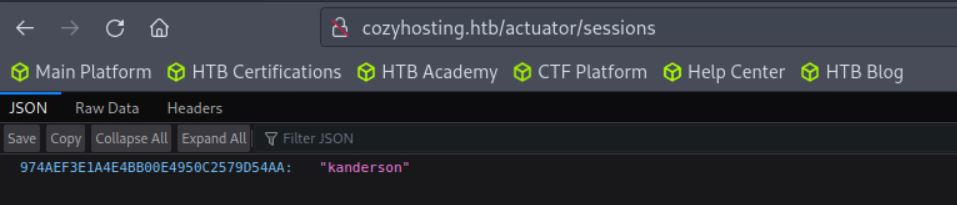

---
tags:
  - Easy
  - Linux
---

# CozyHosting


## Information Générales

- **Difficulté** : Easy
- **Système d'exploitation** : Linux


## Walkthrough

### Hosts

```bash
echo "$ip cozyhosting.htb" | sudo tee -a /etc/hosts
```

### Enumeration

#### Nmap

```bash
$ nmap 10.129.98.140
Starting Nmap 7.93 ( https://nmap.org ) at 2023-10-04 11:12 BST
Nmap scan report for 10.129.98.140
Host is up (0.069s latency).
Not shown: 998 closed tcp ports (conn-refused)
PORT   STATE SERVICE
22/tcp open  ssh
80/tcp open  http
```

PORT 22 - SSH

PORT 80 - HTTP

### Web

#### Dirsearch

```bash
$ ./dirsearch.py -u http://cozyhosting.htb/

  _|. _ _  _  _  _ _|_    v0.4.3
 (_||| _) (/_(_|| (_| )

Extensions: php, aspx, jsp, html, js | HTTP method: GET | Threads: 25 | Wordlist size: 11714

Output: /home/htb-jeanpiffre/Desktop/Git/dirsearch/reports/http_cozyhosting.htb/__23-10-04_16-04-42.txt

Target: http://cozyhosting.htb/

[16:04:42] Starting: 
[16:05:12] 200 -    0B  - /;/admin
[16:05:12] 200 -    0B  - /;/json
[16:05:12] 200 -    0B  - /;admin/
[16:05:12] 200 -    0B  - /;json/
[16:05:12] 400 -  435B  - /\..\..\..\..\..\..\..\..\..\etc\passwd
[16:05:12] 200 -    0B  - /;/login
[16:05:12] 200 -    0B  - /;login/
[16:05:15] 400 -  435B  - /a%5c.aspx
[16:05:18] 200 -    0B  - /actuator/;/auditevents
[16:05:18] 200 -  634B  - /actuator
[16:05:18] 200 -    0B  - /actuator/;/auditLog
[16:05:18] 200 -    0B  - /actuator/;/beans
[16:05:18] 200 -    0B  - /actuator/;/conditions
[16:05:18] 200 -    0B  - /actuator/;/configurationMetadata
[16:05:18] 200 -    0B  - /actuator/;/exportRegisteredServices
[16:05:18] 200 -    0B  - /actuator/;/features
[16:05:18] 200 -    0B  - /actuator/;/flyway
[16:05:18] 200 -    0B  - /actuator/;/health
[16:05:18] 200 -    0B  - /actuator/;/events
[16:05:18] 200 -    0B  - /actuator/;/heapdump
[16:05:18] 200 -    0B  - /actuator/;/httptrace
[16:05:18] 200 -    0B  - /actuator/;/env
[16:05:18] 200 -    0B  - /actuator/;/dump
[16:05:18] 200 -    0B  - /actuator/;/integrationgraph
[16:05:18] 200 -    0B  - /actuator/;/jolokia
[16:05:18] 200 -    0B  - /actuator/;/logfile
[16:05:18] 200 -    0B  - /actuator/;/caches
[16:05:18] 200 -    0B  - /actuator/;/healthcheck
[16:05:18] 200 -    0B  - /actuator/;/configprops
[16:05:18] 200 -    0B  - /actuator/;/info
[16:05:19] 200 -    0B  - /actuator/;/metrics
[16:05:19] 200 -    0B  - /actuator/;/mappings
[16:05:18] 200 -    0B  - /actuator/;/liquibase
[16:05:19] 200 -    0B  - /actuator/;/prometheus
[16:05:19] 200 -    0B  - /actuator/;/registeredServices
[16:05:19] 200 -    0B  - /actuator/;/scheduledtasks
[16:05:19] 200 -    0B  - /actuator/;/loggers
[16:05:19] 200 -    0B  - /actuator/;/sessions
[16:05:19] 200 -    0B  - /actuator/;/shutdown
[16:05:19] 200 -    0B  - /actuator/;/springWebflow
[16:05:19] 200 -    0B  - /actuator/;/ssoSessions
[16:05:19] 200 -    0B  - /actuator/;/refresh
[16:05:19] 200 -    0B  - /actuator/;/statistics
[16:05:19] 200 -    0B  - /actuator/;/status
[16:05:19] 200 -    0B  - /actuator/;/threaddump
[16:05:19] 200 -    0B  - /actuator/;/trace
[16:05:19] 200 -    0B  - /actuator/;/sso
[16:05:19] 200 -    0B  - /actuator/;/releaseAttributes
[16:05:19] 200 -    0B  - /actuator/;/resolveAttributes
[16:05:19] 200 -    0B  - /actuator/;/loggingConfig
[16:05:20] 200 -   15B  - /actuator/health
[16:05:20] 200 -    5KB - /actuator/env
[16:05:21] 200 -   48B  - /actuator/sessions
[16:05:22] 200 -   10KB - /actuator/mappings
[16:05:26] 401 -   97B  - /admin
[16:05:30] 200 -    0B  - /admin/%3bindex/
[16:05:32] 200 -  124KB - /actuator/beans
[16:05:35] 200 -    0B  - /Admin;/
[16:05:35] 200 -    0B  - /admin;/
[16:06:01] 200 -    0B  - /axis//happyaxis.jsp
[16:06:01] 200 -    0B  - /axis2-web//HappyAxis.jsp
[16:06:01] 200 -    0B  - /axis2//axis2-web/HappyAxis.jsp
[16:06:11] 200 -    0B  - /Citrix//AccessPlatform/auth/clientscripts/cookies.js
[16:06:29] 200 -    0B  - /engine/classes/swfupload//swfupload.swf
[16:06:29] 200 -    0B  - /engine/classes/swfupload//swfupload_f9.swf
[16:06:29] 500 -   73B  - /error
[16:06:31] 200 -    0B  - /examples/jsp/%252e%252e/%252e%252e/manager/html/
[16:06:32] 200 -    0B  - /extjs/resources//charts.swf
[16:06:42] 200 -    0B  - /html/js/misc/swfupload//swfupload.swf
[16:06:49] 200 -    0B  - /jkstatus;
[16:06:56] 200 -    4KB - /login
[16:06:56] 200 -    0B  - /login.wdm%2e
[16:06:57] 204 -    0B  - /logout

Task Completed
```

On observe la présence d'un fichier de sessions `/actuator/;/sessions`

#### Sessions

Sur la page web `http://cozyhosting.htb/actuator/sessions`, on trouve une base de données `JSON` avec les ID d'une sessions.



